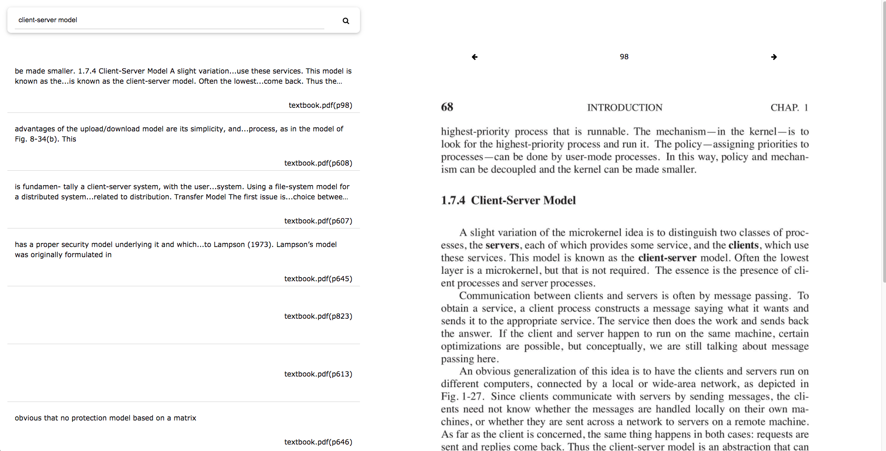

### Description

Full text index search on the contents of pdfs and then search for matches and view them in a web interface.

Using this to quickly search through slides/notes/textbook during open book exams.

### Setup

1. put pdfs in /input that you want indexed
2. start elasticsearch instance:
    `docker run -d --name elasticsearch -p 9200:9200 -p 9300:9300 elasticsearch:6.5.0`
3. run this script to populate the index (this may take a while):
    `python extract.py`
4. run flask app:
    `python -m flask run`
    
### Looks something like this

